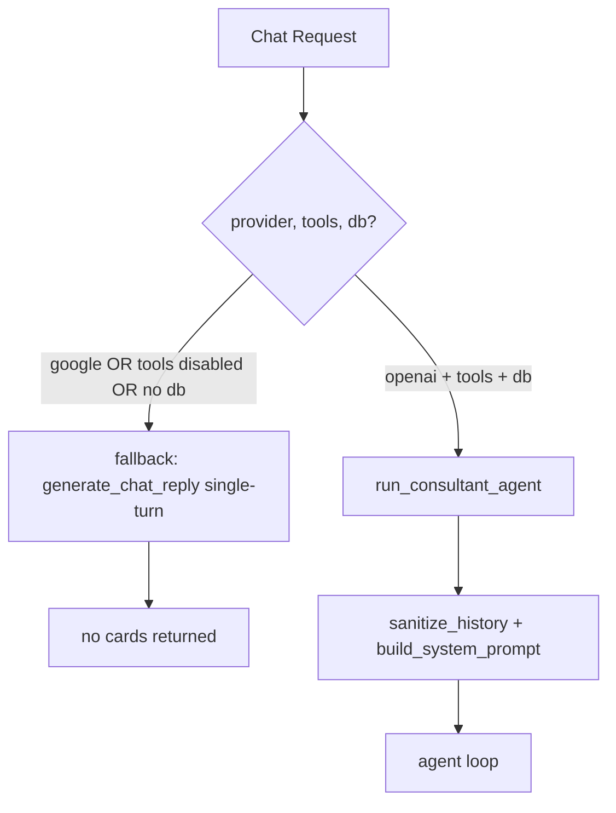
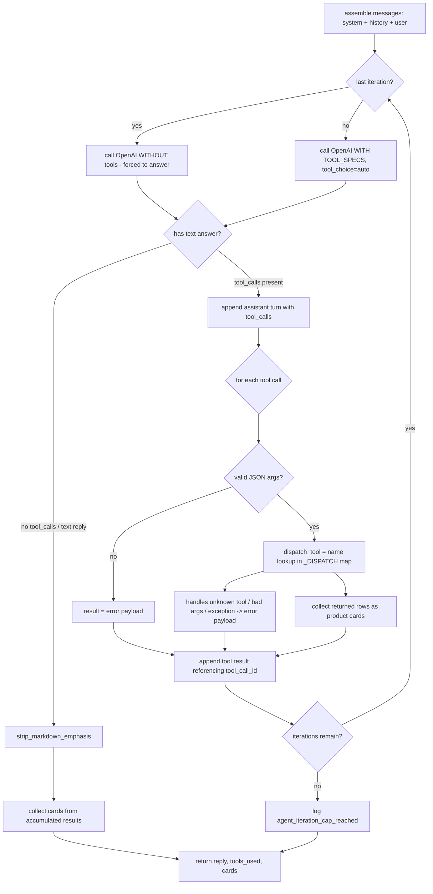
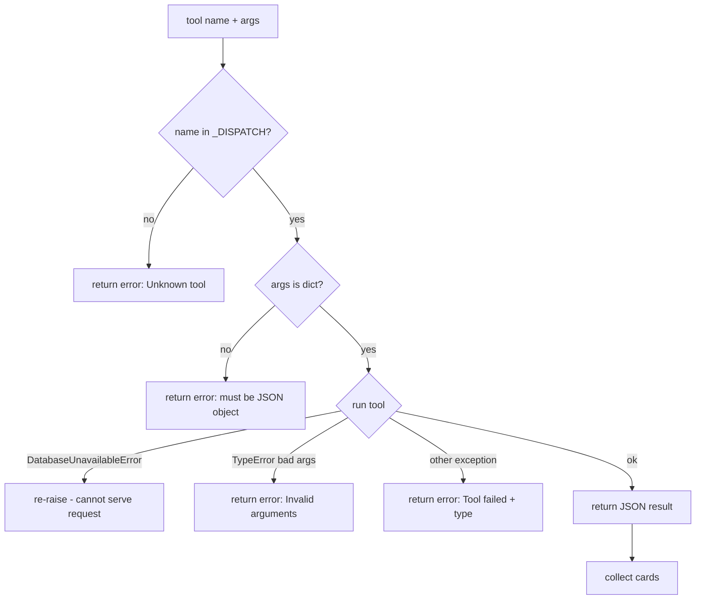
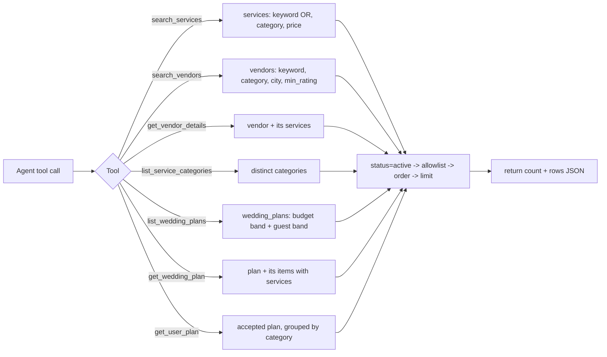
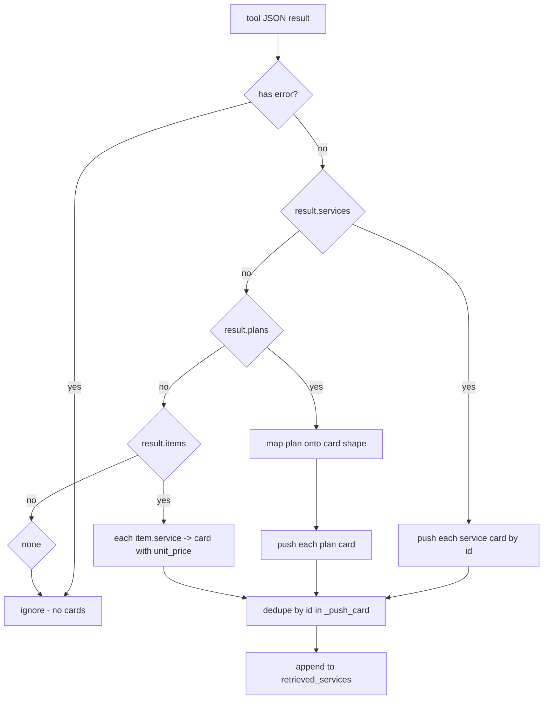
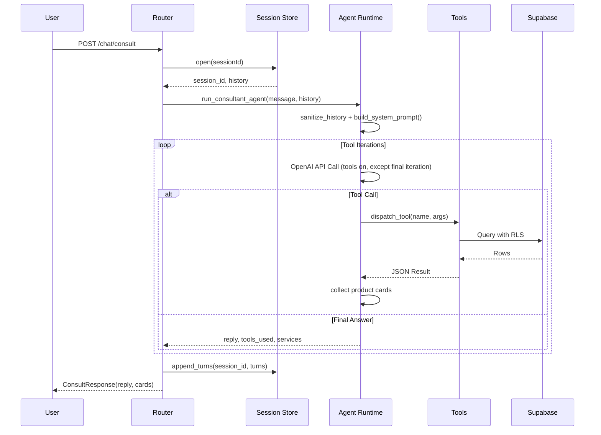
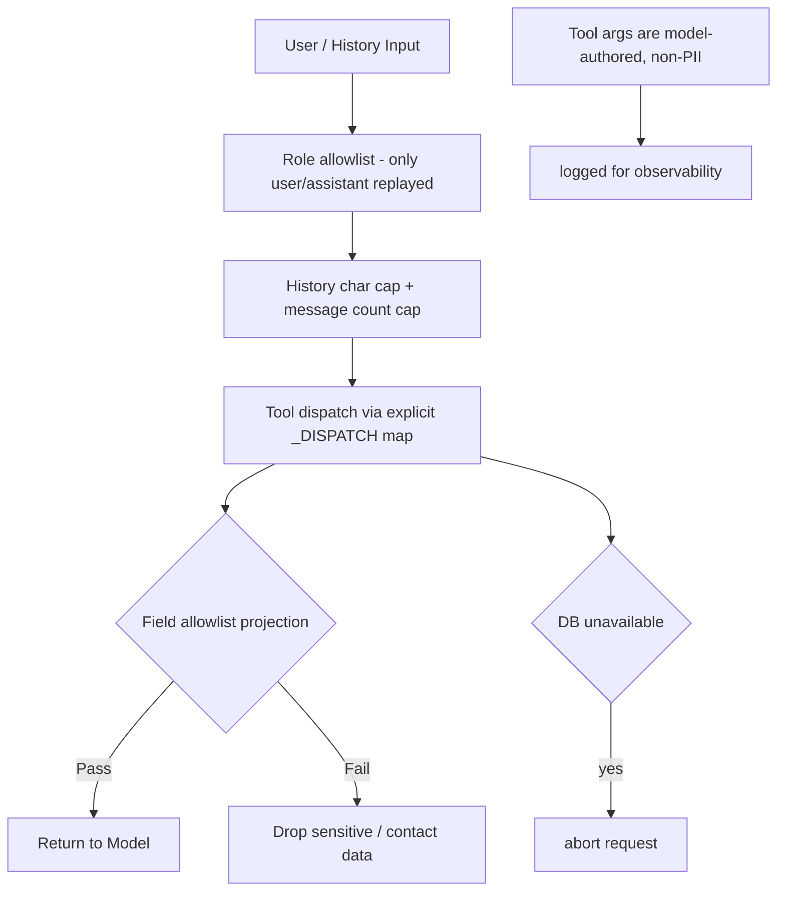

# Agents

Product agent **runtimes** live in the sibling package/repo `../agents`
(not inside this backend tree):

| Package | Role |
| --- | --- |
| `agents/chatbot/` | Couple wedding consultant — system prompt, catalog tools, OpenAI-compatible runtime, session memory |
| `agents/business_intelligence/` | Vendor/admin BI — DB-backed demand proxies (not GMV) |

Install locally:

```bash
pip install -e ../agents
```

HTTP stays in `app/routers/` (`chat.py`, `business_intelligence.py`). Thin
compatibility shims remain under `app/services/` so imports like
`app.services.ai_text` still resolve to the sibling package.

## Couple chatbot

| Module | Purpose |
| --- | --- |
| `chatbot/prompt.py` | Persona + system prompt (`Bé Song Hỷ`) |
| `chatbot/tools.py` | Allowlisted catalog tools (no arbitrary SQL) |
| `chatbot/runtime.py` | `generate_chat_reply`, `run_consultant_agent`, history sanitization |
| `chatbot/session_store.py` | In-memory prototype turn memory |

### Catalog tools

Discovery tools exposed to the couple consultant (all bounded by field
allowlists — no contact/PII, no arbitrary SQL):

| Tool | Purpose |
| --- | --- |
| `search_services` | Find active services by keyword/category/price |
| `search_vendors` | Find active vendors by keyword/category/city/rating |
| `get_vendor_details` | One vendor + its services |
| `list_service_categories` | Distinct catalog categories |
| `list_wedding_plans` | Active curated wedding plans, filter by budget / guest count |
| `get_wedding_plan` | One active plan + its bundled service items |
| `get_user_plan` | **Read-only** recall of the caller's accepted plan, grouped by category |

The consultant prefers the wedding-plan tools when a couple asks for a bundled
offer ("gói cưới") and falls back to the service tools when no plan matches.

`get_user_plan` queries the security-invoker view `v_user_accepted_plan`
(accepted-only, owner-scoped) through the caller-JWT client. It is **read-only**
— the agent never writes plan state (Constitution: agent observes, user
decides). Acceptance writes come only from the authenticated Accept endpoint.

### Workflow

#### Entry-point selection



#### Agent loop (`run_consultant_agent` -> `_run_openai_agent`)

Bounded tool-calling loop. On the **final iteration the tools are withdrawn**
so the model is forced to answer from what it has rather than looping until the
cap and returning nothing usable.



#### Tool dispatch (`dispatch_tool`)

The dispatch map is an explicit dict, never `getattr`, so a hallucinated tool
name resolves to nothing instead of exposing arbitrary functions.



#### Catalog tool routing

All tools gate on `status = active`, project through a field allowlist, sort,
and cap row count (`agent_tool_row_limit`).



#### Tool results -> product cards

The runtime flattens tool output onto the shared product-card shape so the UI
can render cards instead of asking the model to describe images or URLs in
prose. Deduped by `id`. A plan is mapped onto that shape
(`min_budget`->`base_price`, `style`->`category`, cover->`thumbnail`); an item's
service card uses the item's `unit_price`.



#### Sequence diagram



#### Security & privacy boundaries



### Couple consult route

| Method | Path | Auth | Purpose |
| --- | --- | --- | --- |
| `POST` | `/api/v1/chat/consult` | Public (JWT optional) | Couple wedding consultant via `run_consultant_agent` + session store |
| `PUT` | `/api/v1/me/plan-items/{itemType}/{itemId}` | Authenticated | Accept / decline / remove one plan item (`401` anonymous, `422` invalid status, `404` unknown item) |
| `POST` | `/api/v1/chat/threads...` | Authenticated | Durable thread chat (legacy `generate_chat_reply`) |

Couple UI must call `/api/v1/chat/consult`. BI chat is a separate surface and must
not be used as the couple assistant backend.

When a consult request carries a valid JWT, the router injects the caller's
accepted-plan summary (categories + counts, no PII) into the agent's system
context, so the consultant can acknowledge existing choices ("bạn đã chọn xong
…") without re-searching. Anonymous consults receive no plan context.

## Business Intelligence Copilot

DB-backed BI for `vendor_admin` and `admin`. Metrics are **demand/pipeline
proxies** from `service_requests` (leads, pipeline value, budget rate, interested
customers). There is no orders/GMV table yet — GMV labels are deferred.

Persistence: `bi_agent_definitions`, `bi_agent_runs`, `bi_activities`,
`bi_recommendations`, `bi_reports` (migration
`LOMAR/supabase/migrations/20260820000100_business_intelligence.sql`). Optional
RPC `get_vendor_bi_metrics`; the service also computes metrics in Python so
tests work without RPC.

Auth: `require_business_user` (fresh `profiles.role` lookup). Repository scope:
admin → platform (`vendor_id` null); vendor_admin → owned vendor.

### Routes

| Method | Path | Purpose |
| --- | --- | --- |
| `GET` | `/api/v1/business-intelligence/overview` | Metrics, trends, categories, agents, activities, recommendations, and reports |
| `POST` | `/api/v1/business-intelligence/agents/run` | Run one allowlisted analysis agent (writes run + activity) |
| `POST` | `/api/v1/business-intelligence/reports` | Generate a demand-proxy report |
| `POST` | `/api/v1/business-intelligence/actions/preview` | Preview an action without applying it |
| `POST` | `/api/v1/business-intelligence/chat` | Grounded Q&A on real overview numbers (not the couple consultant) |

Empty tables return zero metrics and seeded agent definitions — never fabricated GMV.
